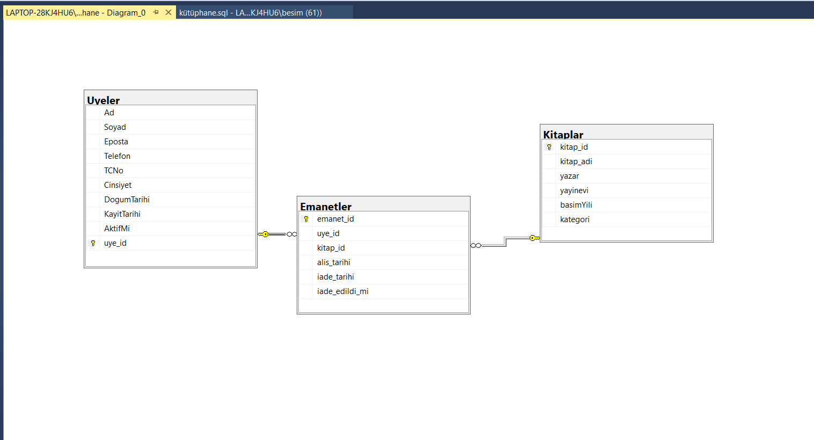

# 📚 Kütüphane Veritabanı Projesi (LibraryDB)

Bu proje, SQL Server üzerinde geliştirilmiş bir **Kütüphane Yönetim Sistemi** veritabanı örneğidir.  
Amaç; üyelerin, kitapların ve emanet işlemlerinin yönetimini kolaylaştırmak için tablolar, prosedürler, triggerlar, fonksiyonlar ve view’lar oluşturmaktır.  

---

## 🗂 Veritabanı Şeması
- **Uyeler**: Kütüphane üyelerinin bilgilerini tutar.  
- **Kitaplar**: Kütüphanedeki kitapların bilgilerini içerir.  
- **Emanetler**: Kitap ödünç alma ve iade işlemlerini saklar.  

ER Diyagram:  


---

## 🛠 Kullanılan Yapılar

### 📌 Tablolar
- **Uyeler**
  - `uye_id`, `Ad`, `Soyad`, `Eposta`, `Telefon`, `TCNo`, `Cinsiyet`, `DogumTarihi`, `KayitTarihi`, `AktifMi`
- **Kitaplar**
  - `kitap_id`, `ad`, `yazar`, `yayinevi`, `basimYili`, `kategori`
- **Emanetler**
  - `emanet_id`, `uye_id`, `kitap_id`, `alis_tarihi`, `iade_tarihi`, `iade_edildi_mi`

### 📌 Prosedürler
- **KitapEmanetEt** → Yeni kitap emanet etme işlemi  
- **KitapIadeEt** → Kitap iade etme işlemi  

### 📌 Trigger
- **trg_Emanet_Insert** → Aynı üye, aynı kitabı iade etmeden tekrar alamaz kuralını uygular.  

### 📌 Fonksiyonlar
- **fn_GecikmeGunSayisi** → Kitap iadesindeki gecikme gün sayısını hesaplar  
- **fn_YasHesapla** → Üye doğum tarihine göre yaş hesaplar  

### 📌 View
- **vw_UyeEmanetDurumu** → Üyelerin ödünç aldıkları kitapları ve iade durumlarını listeler  

---

## 🔍 Örnek Sorgular

**En çok kitap alan üyeleri listeleme**
```sql
SELECT uye_id, COUNT(*) AS alinan_kitap_sayisi
FROM Emanetler
GROUP BY uye_id
ORDER BY alinan_kitap_sayisi DESC;
```
**Cinsiyete göre üye sayısı**
```sql
SELECT cinsiyet, COUNT(*) AS toplam_uye
FROM Uyeler
GROUP BY cinsiyet;
```
**Yayınevine göre sıralama**
```sql
SELECT * FROM Kitaplar
ORDER BY yayinevi ASC;

```
**"G" harfiyle başlayan kitap isimleri**
```sql
SELECT * FROM Kitaplar
WHERE ad LIKE 'G%';

```
## 🚀 Çalıştırma

1. schema.sql dosyasını SQL Server’da çalıştır.

2. queries.sql içindeki örnek sorguları çalıştırarak test et.

3. er-diagram.png üzerinden tablo ilişkilerini incele.

## ✨ Özellikler

- Emanet yönetimi (ödünç alma & iade)

- Aynı kitabı iade etmeden tekrar ödünç alınmasını engelleme (trigger)

- Üyelerin yaş hesaplaması (fonksiyon)

- Kitap ve üye bazlı raporlama sorguları

- Görsel ER diyagramı

## 👩‍💻 Yazar

@umranyalavuz
